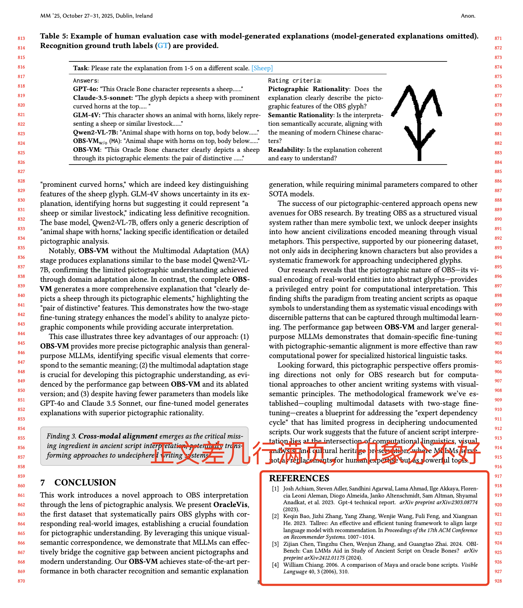

# 3.5 写作细节与Checklist

一篇论文最重要的是选题，其次是创新性和贡献，接下来则是实验效果。如果这三方面都具备了，才可以进入撰写论文的阶段。

## 为什么选题最重要？一个好的问题是一个好研究的起点

- 最好的问题是开辟一个领域，带动了一个产业发展，如诺贝尔奖、图灵奖。
- 数据库的四位图灵奖：数据库之父、关系数据库之父、事务理论之父、数据库系统之父。
- 第二好的问题则是兴起了一波热潮，得到广泛应用，例如 Spark、vLLM。
- 第三好的问题是成为了研究热点，有很多引用。DB 领域引用超过 100 就是不错的研究（不要和 AI 比，领域不同，不能关公比秦琼），超过 1000 凤毛麟角，超过 10000 十年一遇。
- 后续我抽时间专门讲讲如何选题。

## DB 对创新性和贡献要求很高

一定要给评审人一种眼前一亮的感觉。其实更重要的是让读者学到东西、言之有物。如何评价创新性和贡献高呢？

- 如果做这个问题的小问/方法在十分钟之内能想到的话，那说明创新性不足，是不足的。
- 如果小同行一看就能想到/没想到的话，那说明创新性是足的。

## 实验效果是验证所提方法或系统有效性的重要评价

- 如果实验效果不好，那论文可能有价值，说明问题很难，但不是一个好的研究工作。
- DB 对实验效果要求高，性能至少 50% 以上提升，accuracy/Precision 10% 以上为佳。

## DB 对论文的写作要求极高

只有在满足选题新颖、创新性强、实验效果好这三个条件后，才能通过优秀的写作让论文被接受。那么，如何才能写好论文呢？下面将给出详细的 checklist，这里高度凝练一下，类似于论文的 Abstract。

- **逻辑最关键**：论文的逻辑必须清晰，这样读者才会沿着论文的思路展开阅读，而不会产生其他质疑。
- **提纲挈领**：论文要先介绍整体，再介绍细节，让读者先抓住全局再看细节。不管是 Framework（整篇论文的整体介绍），还是每章的第一节，都是先介绍全局，然后展开其中细节。
- **段与段之间有联系**
- **每段有 leading text，全段围绕一个话题**
- **句与句之间有关联**
- **图文并茂**：一幅好的系统架构图起到至关重要的作用。如果图画不清楚，说明作者没想清楚，也不可能写清楚。类似学了一门课程，如果你没能力把它的核心内容画出来，说明你根本没理解。
- **贯穿全文的例子**：有时道理较难理解，但通过一个直观地表达其中蕴含的道理的例子，能让读者更容易理解。
- **自包含（self-contained）**：论文要撰写清晰，使读者无需依赖其他论文的知识便能理解其内容。
- **文章要聚焦**，不要分散，切记包含不相关内容。

---

## Format

### 学会用 Command

```latex
% Leading Text
\newcommand{\hi}[1]{\vspace{.25em}\noindent \textbf{#1}}

% User Comments
\newcommand{\lgl}[1]{\textcolor{blue}{LGL: #1}}

% System Name
\newcommand{\sys}{\texttt{Alpha-SQL}\xspace}
```

切记！论文中自己常用到的一些 term，例如系统名，方法名，容易拼写错的单词，可以定义一个 LaTeX 命令。这样在投稿周期中，如果你的方法名迭代了几次，例如投稿初期用 `MCTS-SQL`，到论文完稿前觉得 `Alpha-SQL` 名字更好更贴切，这样你只需要更改一次 LaTeX 命令即可全文修改，避免改漏的情况！！！其余情况类似。

### Tex 要分章节

```
sections/
figs/
exps/
algs/
main.tex
```

---

## 英语语法问题

Overleaf 上可以安装语法检查的插件，如 Grammarly 和 Overleaf 自带的语法检查插件，可以避免单词拼写错误、简单的第三人称单数问题等。

### 用词准确

- 大小写
- the / a / an
- 单复数

### 第三人称单数、冠词

一句话不能有两个动词，不能有两个子句。

用词要地道合理，不要随便查字典就放上去，可以保守一点，符号简洁清晰，定义了就要用，别用着用着就乱了。**不要写了中文的初稿，然后用 GPT 翻译成英文！！！** 这种会出现非常多不地道或者不标准的术语单词！！！切记读 Paper 时，用翻译软件翻译成中文来读！！！读和写都要用英文！！！养成好习惯。

两句话之间加不上连词的时候，就要小心了。

要用心体会老师/师兄姐的指导，不要经常重复犯错。

逻辑还是第一位的，千万不要让人去猜逻辑，要精简内容，be specific，长难句可多用 Specifically 来切分要表述的内容。

多简单句，少复杂句，一句话说清楚一件事。

介绍清楚即可，不是炫耀英语。

### 语法问题：第三人称单数

- it predicts, it proposes, we propose, they ...

### 冠词：可数名词单数一定要有冠词

- propose (**a**) novel method

### 简单句，句子间用连词或者用句号

- ❌ we propose a method has high efficiency.
- ✅ we propose a method **that** has high efficiency.
- ✅ we propose a method **with** high efficiency.
- ✅ we propose a high-efficient method.

### 其他常见语法问题

- Given a set of queries, we first ... We then ... Moreover, ...
- in (**a**) descending order
- Note that our model supports the case (**that**) ... changed, because ...
- graph embedding **based** database partition
- rather than using ...

---

## LaTeX 写作问题

- 中英文括号文档：注意区分中英文括号。
- LaTeX 中双引号问题：使用 ` `` ` 和 `''` 而不是 `"`。
- LaTeX 中的所有文件名和文件夹名称、内部引用的图表的 label 不要出现空格，也不要使用减号连接，应一律使用下划线连接，此外使用前缀增加可读性：
  - `\label{fig:system_overview}` ✅
  - `\label{sec:intro}` ✅
  - `\label{system overview}` ❌
- 图片应使用 pdf、svg 等矢量图格式，不然如果用 png、jpg 放大会模糊。
- 无特殊情况下，论文中图片表格一般置顶！如果实在不合适可以考虑置底 `[b!]`。
- 引用文章 `~\cite{}` 或引用内部段落、图片 `~\ref{}` 使用 `~` 连接。
- 请使用 `ResNet~\cite{xxxx}`，请勿使用 `ResNet\cite{xxxx}` 或者 `ResNet \cite{xxxx}`，防止出现错误换行。
- 引用多篇文章时使用 `Artificial Intelligence~\cite{xxxx, yyyy, zzzz}`。
- 注意引用规则需要根据具体投稿会议要求修改。
- 引号使用 ` `` ` 而不是 `"`，单引号同理。

---

## 大模型写作问题

> **严禁使用大模型或 AI 生成内容，这是绝对不允许的！** 绝不要这么做！

### "禁用连字符"的情况

#### 连接用途（语义型破折号）

不允许用连字符连接两个分句、插入补充说明或延伸。

- ❌ 例：... closes the research loop—from literature analysis to deployment.
- ✅ 改为：... closes the research loop, covering literature analysis, hypothesis generation, simulation, validation, and deployment.

#### 语义的断句或强调

避免使用破折号作为句子停顿或强调标志。

- ❌ 例：This approach—though simple—is highly effective.
- ✅ 改：Although simple, this approach is highly effective.

### "可用连字符"的情况

- ✅ 正确：This approach is called "data-centric AI", which emphasizes the quality of data rather than the model.
- ✅ 正确：The system outputs what it calls "semantic summaries".
- ❌ 大模型常犯：This approach is called "data-centric AI," which emphasizes the quality of data rather than the model.
- ❌ 大模型常犯：The system outputs what it calls "semantic summaries."

解释：在逻辑型标点体系（如英式或学术写作中更常见）里，标点是否进入引号取决于语义；而大模型大多默认美式风格（标点总在引号内），导致语义不一致。

### 避免使用以下大模型偏好词汇

有经验的审稿人看了会很反感。

- **创新描述**: innovative, pioneering, revolutionary paradigm, transformative framework
- **性能对比**: superior, surpass, excel, remarkable, unprecedented, achieves SOTA, breakthrough performance
- **贡献总结**: general-purpose, is capable of
- **逻辑结构词**: notably, yet, yielding, at its essence
- **动词**: encompass, differentiate, reveal, underscore, surpass, show great potential, exhibit superior capability, exceed, pave the way for, highlight the potential of...
- **词组搭配**: profound challenges（没这种搭配）, stems from
- **形容词**: rigid
- **动词**: impede

---

## 论文各章节常用词 - 词表总结

### 1. Introduction：建立问题与动机

<table>
  <colgroup>
    <col style="width: 22%;">
    <col style="width: 28%;">
    <col style="width: 50%;">
  </colgroup>
  <thead>
    <tr>
      <th>语义功能</th>
      <th>推荐动词</th>
      <th>示例</th>
    </tr>
  </thead>
  <tbody>
    <tr>
      <td>定义与界定</td>
      <td>define, formalize, characterize, outline</td>
      <td>"We formalize Text-to-SQL as a XXX problem."</td>
    </tr>
    <tr>
      <td>描述现象</td>
      <td>observe, note, report, identify</td>
      <td>"We observe that existing models struggle with schema linking."</td>
    </tr>
    <tr>
      <td>提出问题</td>
      <td>highlight, motivate, show, demonstrate, indicate</td>
      <td>"This observation motivates a closer look at compositional reasoning."</td>
    </tr>
    <tr>
      <td>总结局限</td>
      <td>suffer from, fail to, lack, overlook</td>
      <td>"Prior work often fails to handle implicit constraints."</td>
    </tr>
    <tr>
      <td>陈述目标</td>
      <td>aim to, seek to, focus on, pursue</td>
      <td>"We aim to build a cost-efficient reasoning workflow."</td>
    </tr>
  </tbody>
</table>

### 2. Method：描述方案与创新

<table>
  <colgroup>
    <col style="width: 22%;">
    <col style="width: 28%;">
    <col style="width: 50%;">
  </colgroup>
  <thead>
    <tr>
      <th>语义功能</th>
      <th>推荐动词</th>
      <th>示例</th>
    </tr>
  </thead>
  <tbody>
    <tr>
      <td>提出方案</td>
      <td>introduce, propose, develop, design, present</td>
      <td>"We propose a framework that decouples reasoning and execution."</td>
    </tr>
    <tr>
      <td>构建与实现</td>
      <td>implement, integrate, compose, extend, propose, introduce, design</td>
      <td>"We integrate retrieval and reasoning via adaptive controllers."</td>
    </tr>
    <tr>
      <td>改进机制</td>
      <td>enhance, refine, optimize, adjust, augment</td>
      <td>"We refine the decoding process with constraint-aware filtering."</td>
    </tr>
    <tr>
      <td>建模表示</td>
      <td>model, capture, represent, encode, approximate</td>
      <td>"The model captures contextual dependencies through self-attention."</td>
    </tr>
    <tr>
      <td>分析设计动机</td>
      <td>motivate, justify, derive</td>
      <td>"This design choice is motivated by efficiency–accuracy trade-offs."</td>
    </tr>
  </tbody>
</table>

### 3. Experiments：展示与解释结果

<table>
  <colgroup>
    <col style="width: 22%;">
    <col style="width: 28%;">
    <col style="width: 50%;">
  </colgroup>
  <thead>
    <tr>
      <th>语义功能</th>
      <th>推荐动词</th>
      <th>示例</th>
    </tr>
  </thead>
  <tbody>
    <tr>
      <td>展示结果</td>
      <td>show, demonstrate, present, report, illustrate</td>
      <td>"The results demonstrate consistent improvement on Spider."</td>
    </tr>
    <tr>
      <td>分析现象</td>
      <td>analyze, compare, inspect, evaluate, show, report, observe, illustrate</td>
      <td>"We analyze the effect of prompt length on accuracy."</td>
    </tr>
    <tr>
      <td>强调发现</td>
      <td>indicate, suggest, confirm, support, show, demonstrate, highlight, interestingly, surprisingly</td>
      <td>"Findings suggest that multi-step reasoning improves stability."</td>
    </tr>
    <tr>
      <td>验证有效性</td>
      <td>validate, verify, confirm</td>
      <td>"Ablation studies validate the contribution of schema retrieval."</td>
    </tr>
    <tr>
      <td>探讨趋势</td>
      <td>observe, notice, identify, highlight</td>
      <td>"We observe a diminishing return beyond 7B parameters."</td>
    </tr>
  </tbody>
</table>

### 4. Discussion：抽象出洞见与启示

<table>
  <colgroup>
    <col style="width: 22%;">
    <col style="width: 28%;">
    <col style="width: 50%;">
  </colgroup>
  <thead>
    <tr>
      <th>语义功能</th>
      <th>推荐动词</th>
      <th>示例</th>
    </tr>
  </thead>
  <tbody>
    <tr>
      <td>总结发现</td>
      <td>find, reveal, uncover, discover</td>
      <td>"Our findings reveal a critical gap in multi-turn reasoning."</td>
    </tr>
    <tr>
      <td>提出洞见</td>
      <td>suggest, imply, point to</td>
      <td>"These results suggest that scaling alone is insufficient."</td>
    </tr>
    <tr>
      <td>讨论局限</td>
      <td>acknowledge, note, recognize</td>
      <td>"We acknowledge that our evaluation is limited to English."</td>
    </tr>
    <tr>
      <td>展望方向</td>
      <td>envision, anticipate, call for</td>
      <td>"We envision extending this framework to multi-modal settings."</td>
    </tr>
  </tbody>
</table>

---

## 正文要写满

论文的正文部分要充分利用页面空间，确保内容充实。不要出现大量留白或者内容过于稀疏的情况。每一页都应该包含有价值的信息，让审稿人感受到工作的扎实和完整。



---

## 各章节写作指南

### Abstract（摘要）— 论文的高度总结，文章核心的部分

| 句次 | 内容 | 关键点 |
|---|---|---|
| **第一句** | 本文解决什么重要问题？ | what（解决什么问题）+ 背景和意义 |
| **第二句** | 为什么解决？ | why：没人做过 / 现有方法的问题（新问题 or 老问题更快更好更通用） |
| **第三句** | 有什么 Challenges？ | 一定要凝练 challenge，让人信服；不要搞细枝末节；challenges 之间要有关联但无重叠；challenge 是**问题的** challenge，不是方法的 challenge |
| **第四句** | 如何解决？ | how：提出了什么方法？包括几个重要部分？和 challenges 要对应 |
| **第五句** | 实验效果如何？ | 一定要有真实数据集；一定要具体；一定要有代码链接 |

---

### Introduction（引言）— 摘要的扩充版，论文最核心的部分

<table>
  <colgroup>
    <col style="width: 18%;">
    <col style="width: 22%;">
    <col style="width: 60%;">
  </colgroup>
  <thead>
    <tr>
      <th>段落</th>
      <th>内容</th>
      <th>写作要点</th>
    </tr>
  </thead>
  <tbody>
    <tr>
      <td><strong>第一段</strong></td>
      <td>本文解决什么重要问题，给出具体应用例子</td>
      <td>解决什么问题，有什么应用</td>
    </tr>
    <tr>
      <td><strong>第二段</strong></td>
      <td>为什么需要解决？现有方法的问题是什么？</td>
      <td>高度凝练现有方法的 Limitations，直击要害，<strong>切记不要罗列太多细节</strong>；新问题说明应用价值；老问题说明现有方法根本缺陷</td>
    </tr>
    <tr>
      <td><strong>第三段</strong></td>
      <td>有什么 Challenges？为什么难？</td>
      <td>写<strong>问题的</strong> challenges，不是方法的 challenges；要让人能看懂；challenges 之间逻辑清晰，不要互相覆盖</td>
    </tr>
    <tr>
      <td><strong>第四段</strong></td>
      <td>如何解决？给出方法总结</td>
      <td>方法和 challenges 要对应；所有 claim 的优势都要有兑现；<strong>一定要有创新，不要写没有创新的内容</strong></td>
    </tr>
    <tr>
      <td><strong>第五段</strong></td>
      <td>实验结果</td>
      <td>超过了现有方法，具体数据</td>
    </tr>
    <tr>
      <td><strong>第六段</strong></td>
      <td>总结贡献：3 个创新点 + 实验结果</td>
      <td>contributions 和 challenges 一定要对应！</td>
    </tr>
  </tbody>
</table>

**注意事项**：
- **吸引审稿人，几乎决定文章能否被录取**
- **突出创新点，突出技术深度**
- **明确说出和现有方法的区别**
- **只写创新，少写、尽量不写别人的东西**
- **用词要准确，一定要让人抓住论文核心，主次要分明**

---

### Problem Formulation（问题定义）

1. 首先**文字描述**问题定义，让读者能看懂
2. 然后写**公式**，formal 定义要解决的问题
3. 最后通过**例子**说明该问题，让读者深入理解

> 一篇文章最好只解决一个问题，不要多个问题。一个好例子胜过一篇好文章，设计精妙的贯穿全文的例子至关重要。

---

### Framework（方法章节）— 文章第二核心的部分

**总体原则**：总分架构，这章是全文技术的总结，后续每章也都是总分结构。

1. **整体架构概述**：介绍提出方法/系统的整体 Architecture，看完这部分基本能读懂整体技术
2. **Workflow 介绍**：介绍系统/方法的整体流程，让读者轻松读懂，不要过于复杂
3. **各个 Component**：
   - 简单的 component 在 Framework 章节直接介绍清楚
   - 复杂的 component 写清楚做什么事情、基本思路，详细方法 ref 到后续章节

**必须做到**：
- **一定要写清楚创新性和贡献**
- **一定要有整体系统架构图**
- **如果没有创新，不要写！众所周知的内容写的越多，副作用越大**
- 后续章节：先写创新性强的点，再写创新性稍弱的点，最后写最弱的点
- 一定要自包含，图文并茂，有 leading text 概述本小节内容

**常见结构示例**：

- 左中右结构通常对应"输入 → 核心流程 → 输出"，适合展示线性主流程。
- 上下结构通常对应"Offline + Online"或"训练 + 推理"这类双层系统。


**切记**：
- 一个问题提出了多个方法，要能解释为什么不只提出最好的方法
- 主要讲自己的东西，他人的东西放到 Related Work
- 符号前后要统一，说法前后要一致，不要矛盾

---

### Experiments（实验章节）— 文章第三核心的部分

> 实验章节一般用**过去时**，其他部分用现在时。

**实验设置**：
- 先说实验目的：要比较什么？
- 数据集至少 3 个
- 评价方法、评价指标（latency, Accuracy, cost 等）
- Baseline：一定要选择合适的 Baseline，**不要漏掉显而易见的 Baseline**；如果论文 A 证明了比 B 和 C 好，可以只比 A，并在文中说明 A 比 B、C 好

**Overall 比较**：
- 先写端到端比较，和所有 baseline 全面比较
- 先说比较什么（latency/Accuracy/…），再分析实验图效果
- 给出好了多少，给出好的理由，深入分析，给出 findings

**其他细节比较**：数据集大小 scalability、计算集群 scale-out、模型大小影响等

**消融实验（Ablation Study）**：
- 评估每个贡献的实验效果
- 例如三个技术点 A B C，比较 All、without A、without B、without C 四种方法
- 测试不同的参数

**注意事项**：
- 一定要有真实数据集，一定要有说服力的 Baseline
- 一定要突出结论：通过实验表明了什么？证明了什么？为什么？

---

### Related Work（相关工作）

**位置选择**：
- 放在**第二章**：论文依赖 Related Work 内容（需要使用其框架、模型和方法）
- 放在**倒数第二章**：论文不依赖 Related Work（没有这部分，论文也能读懂）。好论文一般应放在倒数第二章

**写作规范**：
- **不要抄袭别人东西，一句话不能抄袭，一定要自己总结、自己凝练（红线！！！）**
- **不要抄袭别人语句，任何句子都不可以**
- 实事求是，不能过分批评别人，给别人 credit
- 要抓重点，不要讲细枝末节
- 要自包含，要写清楚本文和 related work 的区别，为什么他们不能解决本文的问题
- 分类阐述，先说方法，然后说出区别；直接相关的论文直观给出其 Limitations，不直接相关的少批评多夸奖
- 参考文献用会议简称（SIGMOD/VLDB/ICDE/TKDE 等），到 DBLP 拿 bibtex，包含会议、页码、年份、作者、题目

---

### Conclusion（结论）

- 总结文章贡献，**不要与引言重复**
- 引言：读者还不知道技术细节 → 引出问题和方法
- 结论：读者已看完论文 → 总结贡献和意义
- 一般用现在完成时（present perfect tense）

---

## 好文章特点 / 坏文章特点

### 好文章特点

- 选题新颖
- 技术深度强
- 足够的贡献
- 清晰的逻辑结构
- 良好的表达能力，简洁明了
- 图文并茂
- 可靠的/可重现的结果
- 精选的参考文献

### 坏文章特点

- **Delta work**：修补别人论文，创新不足，贡献不够
- 别人 3-5 分钟就能想到类似或更好的方法
- 现有技术的简单堆叠（例如堆叠多个模型、很多参数、混合很多方法）
- 相关技术即使没用于解决本问题，但用于解决类似问题，贡献也不足（例如别人用 MCTS 解决查询重写，你再用 MCTS 解决估计问题，会被质疑）
- **切记拿老模型、老方法解决问题，只有第一个才会被认可、被记住**
- 相关技术的小修小补
- 方法过于复杂，很难解决实际问题，很难落地
- 逻辑混乱，难以读懂
- 效果提升少
- 过于批判其他相关方法
- 方法难以重现，不开源代码和数据

---

## 细节注意事项

- **逻辑是第一位的**：每句话都要有目的，每两句话之间都要有联系；每个 claim 都要有证据，每个 criticism 都要有根据
- 一定要**自包含**，读者不需要任何其他论文背景就能读懂
- 最好有**贯穿全文的例子**
- 每个符号只有一个含义，不能一个符号用多次
- **前后要一致**，不能矛盾
- 上下句要连贯，不要东一榔头西一杠子
- 为什么现有方法不能解决这些问题？为什么论文提出的方法能解决 challenges？一定要给出具体理由
- 用词一定要地道，选择合理，一个合适的词让人更容易理解
- 写任何一句话都要有目的，不要跳出一句让人猜测的话
- **符号问题**：能少用就少用；超过 6 个常用符号最好有 notation table；不要有歧义；概念必须定义（where ** denotes **）
- `Figure~\ref{***}` 用 `~` 防止不应该的分行

---

## Paper Revision LaTeX 模板

投稿修改（Revision）时，建议采用以下规范化流程：

**文件组织结构**：
```
sections/
figs/
exps/
algs/
responses/
  meta.tex
  r1.tex
  r2.tex
  r3.tex
main.tex
commands.tex
LLM.bib
```

**main.tex 在 Revision 时增加**：
```latex
\section*{Response to Reviewer Comments}

Dear Reviewers,

Thank you for your insightful reviews and constructive suggestions, based on which 
we have significantly improved our paper. The major revised parts are highlighted 
in \revision{blue} in the paper.

\input{response/r1}
\input{response/r2}
\input{response/r3}
```

**常用 commands**：
```latex
% 修改处标蓝色
\newcommand{\revision}[1]{\textcolor{blue}{#1}}

% 右栏标注（对应 reviewer comment 编号）
\marginpar[]{\revision{R1.W1}}{\revision{XXXXXX}}

% 左栏标注
\marginpar[\revision{R3.W2}]{}{\revision{XXX}}
```

每个 response 文件（r1.tex, r2.tex, r3.tex）都需要一个汇总表格，格式为：原始 reviewer comment 编号、修改内容、修改的章节（如 R1.W1, clarify the motivation, section 1）。
