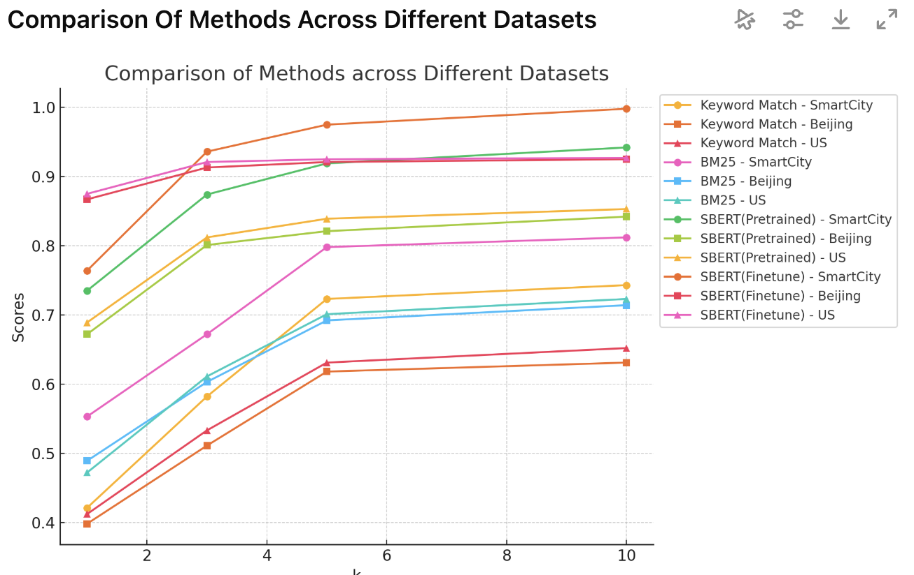
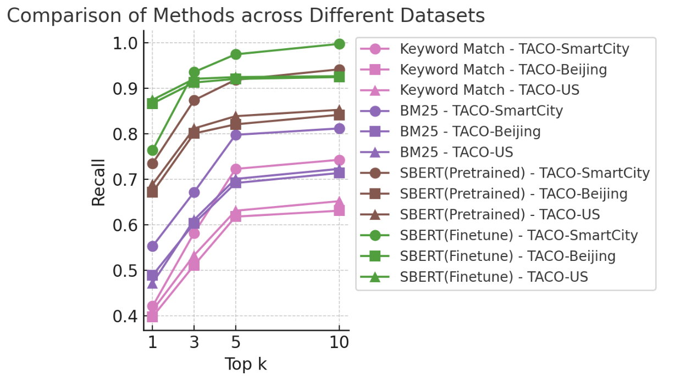

# 4.3 Experimental Results Figure（实验结果图）

## 核心目标

Experimental Results Figure 的使命是用最直观、最具说服力的方式展示你的实验数据，支撑论文的核心结论。好的实验图能让审稿人快速验证你的方法是否真的有效，差的实验图则会让审稿人质疑你的实验是否可靠。

## 常见的图表类型与适用场景

不同的实验目的需要选择不同的图表类型。以下是数据智能领域最常用的实验图表类型及其适用场景：

| 图表类型 | 适用场景 | 设计要点 |
|---------|---------|---------|
| 分组柱状图（Grouped Bar Chart） | 多方法在多数据集上的 Overall Performance 对比 | 你的方法用深色高亮，基线用浅色。每组柱子之间留适当间距，在柱子顶部标注具体数值 |
| 折线图（Line Chart） | 参数敏感性分析、训练曲线、随时间/规模变化的趋势 | 不同方法使用不同的颜色+线型+标记的组合（如实线+圆点、虚线+方块、点划线+三角形），确保黑白打印也能区分 |
| 热力图（Heatmap） | 相关性矩阵、注意力权重可视化、模块/方法的性能矩阵 | 使用连续色阶（如蓝-白-红），标注每个格子的具体数值 |
| 散点图（Scatter Plot） | 效率-效果权衡（Efficiency-Effectiveness Trade-off） | X 轴为效率指标（如推理时间），Y 轴为效果指标（如准确率）。你的方法应该出现在右上角（又快又好） |
| 箱线图（Box Plot） | 展示结果的分布和稳定性 | 适合展示多次运行的结果分布。比单纯报告均值更有说服力 |
| 雷达图（Radar Chart） | 多维度综合对比 | 适合在一张图中同时对比多个方法在多个维度（准确率、效率、鲁棒性等）上的表现 |

## 设计原则

### 自包含（Self-contained）

实验图必须能够独立存在。图注（Caption）、坐标轴标签（Axis Labels）、图例（Legend）必须完整。读者不看正文也能看懂这张图在对比什么、结论是什么。图注的第一句话应该概括这张图的核心发现，例如：

> "Figure 5: Performance comparison on BIRD benchmark. Our method consistently outperforms all baselines across different model sizes."

### 科学严谨的视觉编码

避免"图表垃圾"（Chartjunk）。不要使用 3D 柱状图、不必要的阴影、花哨的背景或复杂的网格线。保持扁平化、简洁的设计。颜色与线型必须**双重编码**：考虑到部分读者可能有色觉障碍，或者论文被黑白打印，绝不能仅仅依靠颜色来区分不同的曲线或柱子。

### 突出你的方法

如果你的方法（Ours）在多个基线中表现最好，可以使用对比度更高的颜色（如深红色或深蓝色）来高亮代表你方法的柱子或曲线，而将其他基线方法设置为灰色或较浅的颜色。在 Alpha-SQL 的 Figure 1 中，"Ours"使用了醒目的亮色高亮，在一众灰色和浅色的基线中格外突出。

### 不要误导读者

Y 轴的起点必须合理。如果所有方法的准确率都在 60%-80% 之间，不要把 Y 轴从 0 开始（这样看起来差异微不足道），但也不要从 59% 开始（这会夸大差异）。一个合理的做法是从 55% 或 50% 开始，并在图中标注。

## 案例分析

**画布尺寸过大的问题**：一个常见错误是画图的 Canvas 太大，导致文本标签（Text Labels）的字体相对过小，插入 LaTeX 之后看不清楚。正确做法是使用小的画图 Canvas（如长宽 150×100pt），让字体在缩放后自然变大。

| 原始图 | 优化后 |
|---|---|
|  |  |

> 建议在项目初期就建立一个统一的绘图脚本模板（如 `plot_utils.py`），定义好统一的颜色方案、字体大小、线宽等参数。这样在后续绘制多张实验图时，只需要替换数据即可保持风格一致。

## 工具推荐

也可以用 Excel 等工具把你实验结果的表格先做好，然后 Prompt LLMs 生成对应的实验插图代码。

| 首选工具 | 备选工具 | 说明 |
|---------|---------|------|
| Matplotlib + Seaborn | TikZ / PGFPlots | 必须使用代码生成，保证可重复性 |
