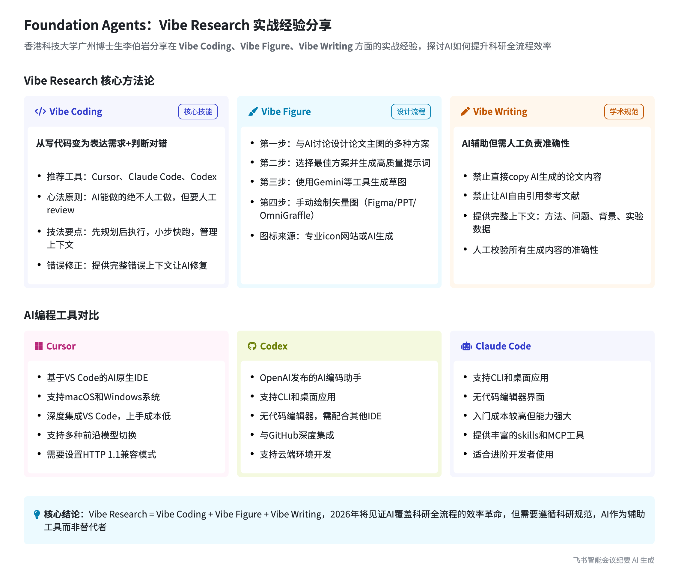

# 5.2 李伯岩 Vibe Research / Vibe Coding 实战经验 — 会议纪要

## 会议信息

| 项目 | 内容 |
|------|------|
| 会议主题 | Foundation Agents 2026/02/10 20:00 李伯岩 Vibe Research / Vibe Coding 实战经验 |
| 会议时间 | 2026 年 2 月 10 日（周二）19:46 - 20:45（GMT+08） |
| 会中共享文档 | Vibe Research/Vibe Coding 入门及经验分享 |

---

## 总结

**Board: Foundation Agents — Vibe Research 实战经验分享**

香港科技大学广州博士生李伯岩分享在 Vibe Coding、Vibe Figure、Vibe Writing 方面的实战经验，探讨 AI 如何提升科研全流程效率。

### Vibe Research 核心方法论

| Vibe Coding（核心能力） | Vibe Figure（设计流程） | Vibe Writing（写作辅助） |
|---|---|---|
| 从写代码变为表达需求 + 判断对错 | 第一步：与 AI 讨论设计论文主图的多种方案 | AI 辅助但需人工负责准确性 |
| 推荐工具：Cursor、Claude Code、Codex | 第二步：选择最佳方案并生成高质量提示词 | 禁止直接 copy AI 生成的论文内容 |
| 心法原则：AI 能做的绝不人工做，但需人工 review | 第三步：使用 Gemini 等工具生成草图 | 禁止让 AI 自动引用参考文献 |
| 技法要点：先规划后执行、小步快跑、详细日志 | 第四步：手动绘制矢量图（Figma/PPT/OmniGraffle） | 提供完整上下文：方法、问题、背景、实验数据 |

---

## Vibe Research / Vibe Coding 背景与趋势

### Web Coding 发展变革

- **概念提出**：去年 2 月 OpenAI 联合创始人首次提出"氛围编程"（Vibe Coding）概念，引发编程革命，去年 11 月 Vibe Coding 当选柯林斯年度词汇。
- **当前规模**：全球著名创业孵化器 CEO 统计，25% 的创业公司里 95% 的代码由 AI 生成。
- **对科研的影响**：Vibe Coding 让非 AI 从业者获得想法及产品能力，提高科研编码效率，缩短论文发表周期，2026 年有望覆盖整个科研流程。

### Vibe Research 的构成

李伯岩认为 Vibe Research 可分为三个部分，涵盖科研从想法提出到代码实现、论文写作画图的全过程：

1. **Vibe Coding** — 代码实现
2. **Vibe Figure** — 论文绘图
3. **Vibe Writing** — 论文写作

---

## Vibe Coding 工具与使用方法

### 工具选择

李伯岩推荐使用前沿模型和好用工具，建议即便可能需要付费也要选择强大的工具：

| 工具 | 特点 | 适用场景 |
|---|---|---|
| **Cursor** | 基于 VS Code 的 AI 原生 IDE，入门成本最低；支持调用不同前沿模型；插件生态丰富（Git Lens 等） | 入门首选，团队协作 |
| **Codex** | OpenAI 发布的 AI 编码助手，与 GitHub 集成好 | GitHub 用户 |
| **Claude Code** | 功能强大，入门成本稍高 | 进阶使用 |

**Cursor 使用注意事项**：
- 在官网下载安装，支持调用不同前沿模型，但使用强模型可能需要付费和代理
- 需在设置里将 HTTP 兼容性模式调成 1.1，以访问世界前沿模型
- 支持丰富的插件生态，可按需安装

### Vibe Coding 心法原则

- **AI 能做的不要人工做**：相信 AI，但要自己 review 代码
- **以目的主导对话**：以目标为导向，上下文为王，避免 AI 写无关代码
- **减法思维 / MVP 思想**：一次交互不让 AI 完成大量代码，开发遵循最小可行产品原则

### Vibe Coding 技法技巧

1. **先规划后执行**：用 Plan Mode 生成 AI 计划，与 AI 讨论确定方案后再执行
2. **提出明确需求**：包括实现内容、功能、输入输出、代码规范等
3. **小步快跑**：让 AI 实现最小功能单元，及时进行 Code Review 和测试
4. **管理上下文**：复杂任务拆分为子任务，补充缺失的上下文
5. **提供纠错上下文**：AI 出错时提供足够上下文帮助修正
6. **熟练使用 git**：进行版本控制，保留回滚能力

---

## 论文写作与绘图技巧

### Vibe Figure 绘图流程（四步法）

**第一步：绘图设计**
将论文逻辑告知 AI（如与 GPT 对话），让其提出多种主图画法方案（如方案 a 到方案 f），从中选择最佳方案。

**第二步：生成提示词**
基于确定的画法，让 GPT 或 Gemini 生成符合论文投稿规范（如使用英文字体、符合 SML Oral 质量）的生图提示词。

**第三步：生成草图**
将提示词用于 Gemini 网页端或 Nano Banana Pro 等文生图模型生图。生成的图为草图，若提示词符合预期，草图质量一般不会差。

**第四步：绘制矢量图**
用绘图工具对照草图绘制矢量图（Gemini 或 Nano Banana 生成的光栅图不能直接用于论文）：
- 推荐工具：**Figma**、**OmniGraffle**、**PPT**，工具无高低之分，熟练使用即可
- 图标来源：从 icon 网站下载，或用 GPT 生成（可让 AI 仿照已有 icon 风格重画）
- PNG 转矢量图：可使用 Edit Banana 等工具，或在 Figma/PPT 中手动绘制；SVG 是最规范的矢量格式

### Vibe Writing 写作准则

- **严禁**直接 copy AI 生成的 paper 内容到自己的论文中，要对内容准确性、AI 率负责
- **严禁**让 AI 撰写参考文献或自由引用
- **正确用法**：给定足够上下文（研究问题背景、方法、局限、挑战、实验数据、论文图例等），让 AI 辅助写作思路；但需人工校验每一句话的准确性

---

## 问答环节

**Q：如何借助大模型 AI 提出可行的研究想法？**（骆昱宇提问）

李伯岩认为：目前 AI 直接提出可行性高的 idea 能力有限，但可以就具体问题与 AI 深入讨论。例如降低 Text-to-SQL 的 schema 成本问题，通过不断"拷打"AI 的方案，结合自身经验引导，有较大概率让 AI 提出可行想法。

**Q：Web icon 的具体做法？PNG 能否转 SVG？**

- 可让 AI 仿照已有 icon 风格重画
- PNG icon 一般可放入图里，但大图建议转成 SVG 矢量格式
- PNG 转 SVG 工具：Edit Banana（骆老师推荐）、VI VectorRise 等矢量化工具；也可在 Figma 或 PPT 中手动绘制
- 从 Gemini 网站下载的是 PNG，PDF/SVG 才是矢量格式

**Q：copilot 性能与模型选择？**

- copilot 可在设置里选择不同模型，AI 工具没有绝对好坏
- 建议使用成熟的 IDE 或 CLI（而非插件），因为 IDE 的上下文工程更好
- 若使用 copilot 插件，可选择 Gemini Pro、Claude Code 4.5/4.6 等更强的模型

**Q：AI 是否具备闭环科研能力？**

李伯岩认为：AI 目前欠缺完整的闭环 research 能力，但可以尝试将论文发表周期提炼作为上下文让 AI 学习，探索其提出更有前景想法的可能性。

---

## 智能章节摘要（AI 生成，按时间戳）

| 时间 | 章节主题 | 核心内容摘要 |
|---|---|---|
| 15:55 | 香港科大博士分享 Vibe 科研经验及行为准则 | 李伯岩介绍 Vibe Research 三部分，强调以 AI 为辅助并自我验证的科研行为准则 |
| 20:12 | 氛围编程概念引发革命及年度词汇 | 去年 2 月 OpenAI 联合创始人提出氛围编程，去年 11 月成为柯林斯年度词汇 |
| 20:57 | AI 辅助编码对科研的重要性 | 全球 25% 创业公司 95% 代码由 AI 生成；Vibe Coding 是科研必须掌握的技能 |
| 21:29 | 氛围编程的变与不变 | 变：写代码 → 表达需求+判断对错；不变：明确需求、判断结果好坏、独立解决思路 |
| 23:29 | AI 编程工具介绍与选用建议 | 推荐 Cursor、Codex、Claude Code，建议选用前沿模型和好用工具 |
| 26:44 | Cursor 下载安装、使用设置及插件选择 | HTTP 兼容性模式调为 1.1；支持丰富插件生态 |
| 29:59 | Vibe Coding 心法原则 | AI 能做的不人工做；以目的主导；上下文为王；减法思维 |
| 31:54 | Vibe Coding 技法技巧 | 先规划后执行；提出明确需求；小步快跑；管理上下文；git 版本控制 |
| 41:22 | 论文写作中借助 AI 进行绘图设计与提示词生成 | 先让 AI 提出多种方案，再让 AI 生成符合投稿规范的提示词 |
| 42:41 | 生成草图与矢量图绘制流程 | 用 Gemini/Nano Banana 生成草图，再用 Figma/OmniGraffle/PPT 绘制矢量图 |
| 45:20 | Vibe Writing 写作准则 | 严禁直接 copy AI 内容；严禁 AI 写参考文献；给足上下文辅助写作 |
| 46:02 | AI 辅助写作规范及内容准确性自验 | 语言模型仅辅助写作思路，要自行负责、理解并校验准确性 |
| 47:21 | 借助 AI 获取可行研究想法 | AI 直接提 idea 能力有限；建议与 AI 深入讨论具体问题，结合自身经验引导 |
| 50:08 | Web icon 生成及 AI 闭环研究探讨 | icon 风格重画；PNG 转矢量建议；AI 闭环 research 能力探讨 |
| 54:24 | AI 编程工具选择建议及强模型推荐 | 建议使用成熟 IDE/CLI；copilot 可选 Gemini Pro、Claude Code 4.5/4.6 |
| 55:37 | icon 是否转 SVG 格式的建议 | 建议转 SVG 最规范；工具：VI VectorRise、Edit Banana |
| 56:22 | PNG 转矢量图方法及 Edit Banana 工具探讨 | PDF/SVG 是矢量图；Edit Banana 可能可转高质量矢量图 |
