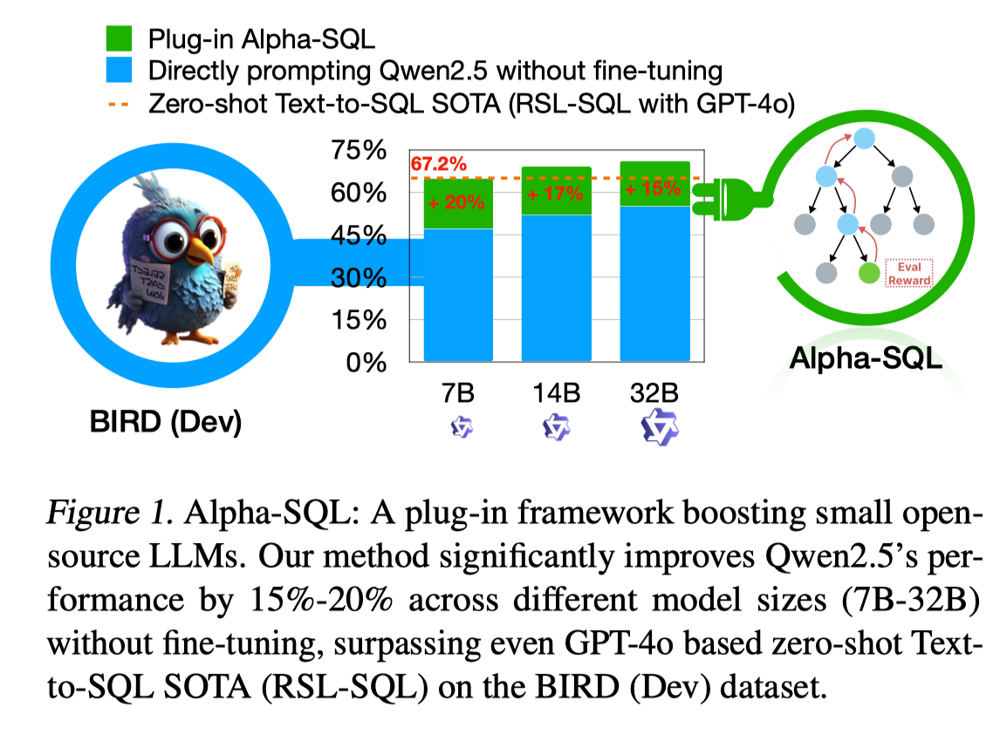
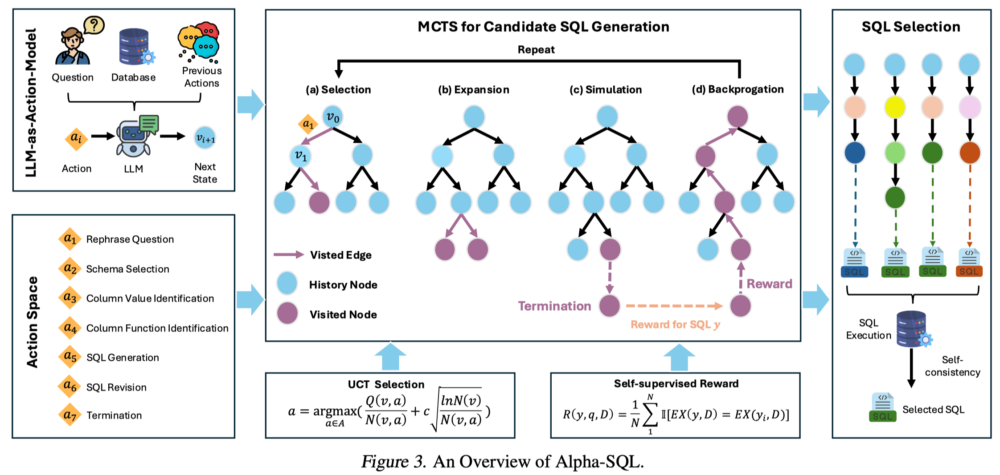

# 6.1 ICML 2025 — Alpha-SQL 写作思路剖析

> **论文**：Alpha-SQL: Zero-Shot Text-to-SQL using Monte Carlo Tree Search
> **会议**：ICML 2025
> **原文链接**：https://openreview.net/pdf?id=kGg1ndttmI

---

## 论文 Introduction 写作的思考模型（Introduction 是整个论文的精简版）

一般来说，Introduction 可以看作整篇论文的"压缩版"：用最少的篇幅把研究对象讲清楚，把问题为什么难讲透，再把我们的方法为什么必要讲明白。一个清晰的写作组织是：先用一个典型应用场景/运行例子引出研究背景与需求；随后对现有代表性工作进行归纳，提炼其在关键假设、数据特性、工作负载与系统约束下暴露的主要局限（通常不超过 3 点）；在此基础上进一步刻画该问题的本质属性与硬约束（例如规模、动态性、异构性、端到端开销、正确性/一致性要求等），从而自然导出本文要解决的研究目标或问题定义（Our Goal / Problem Formulation），或支撑方案设计的核心洞见（Key Idea）。接着，需要明确实现该目标所面临的关键挑战（通常不超过 3 点），解释为何直接套用或简单扩展已有方法难以奏效。最后给出与挑战一一对应的方法总览（整体框架与关键模块），并以贡献点收束：包括问题定义/设定（若有）、系统/框架设计、1–2 个关键技术点以及充分的实验评估与分析。

---

## Introduction 写作/构思的 Flowchart

<!-- 图片：Introduction写作Flowchart -->

Flowchart 的核心逻辑链：

> **研究背景** → **研究前沿（现有方法）** → **Limitations（不超过 3 点）** → **Key Idea / Our Goal** → **Challenges（不超过 3 点）** → **方法总览** → **贡献点**

---

## 基于 Flowchart，对原文 Introduction 的写法进行剖析

### 快速定位：这篇论文是什么类型？

**Technique paper（新方法解决既有问题）**
- 主轴：Key Idea / Mechanism
- Goal：一句话交代即可

**对比另一类论文：Propose a New Research Problem/Setting（新问题/新设定/新任务）**
- 主轴：Our Goal / Problem Formulation（问题定义本身是贡献）
- Key Idea：作为"为什么这样定义合理/可行"的支撑

Alpha-SQL 属于前者——对已有问题"Text-to-SQL"提出新的技术方法。

---

### 基于 Flowchart，我转成 Table，方便将原文思路映射到对应的逻辑阶段

> 请下载原文，对照着看。原文链接：https://openreview.net/pdf?id=kGg1ndttmI

| 逻辑阶段 | 原文内容与写作思路剖析 |
|---|---|
| **研究背景** | |
| 研究场景是什么？为什么重要？需要一个清晰的场景定义 + 研究动机 | "Text-to-SQL (a.k.a. NL2SQL) converts natural language queries into SQL, simplifying access to relational databases and enabling both lay and expert users to derive insights effectively." **写作思路**：交代大的背景，Text-to-SQL 很重要，很多人关注，尤其是 LLMs 出来后，现有的方法取得了极大的进展。 |
| **研究问题分析与属性解读** | |
| 对现状或者现有最新方法的分析，总结局限性。一般总结不超过 3 个现有方法或现有问题的局限性。 | "Generally, these LLM-based Text-to-SQL methods fall into two categories: trained methods and zero-shot methods." **写作思路**：开始过渡了，分析一下现有方法的不足。 |
| **Limitation 1** | "**Training LLMs for Text-to-SQL.** Pre-training or fine-tuning LLMs on task-specific datasets is a common approach to improving Text-to-SQL performance... While effective, this method requires extensive labeled datasets and significant computational resources for model training. Moreover, as newer and more powerful LLMs emerge, the training process must be repeated to maintain competitive performance, further increasing the cost and effort." **写作思路**：训模型的方法不足——训练数据和训练资源的开销；新的基座模型来了，又需要重新微调，费时费力。 |
| **Limitation 2** | "**Zero-Shot LLMs for Text-to-SQL.** As an alternative, zero-shot Text-to-SQL methods... leverage the general knowledge encoded in LLMs to generate SQL queries without requiring task-specific fine-tuning... While this approach offers a practical and cost-effective solution, it faces a fundamental challenge. The key challenge in zero-shot Text-to-SQL is the difficulty of transferring and generalizing knowledge from pre-trained LLMs to the specific task of SQL generation..." **写作思路**：过渡一下，上面讲了训模型的不足，ok，那我们能不能走不训练模型的路线？当然可以，但现有方法依然有不足。在这里接着分析 Zero-shot LLMs for Text-to-SQL 的不足，分析根因。思路是针对这类方法不足的根因，提出从底子上改进的思路，不是简单地做表面改进。 |
| **Limitation 3** | 这篇论文没有讨论第三类局限。因为这篇论文的思路是：解决这个问题有 A 类型的方法和 B 类型的方法，我们分别讨论 A 类型和 B 类型方法的不足，然后讲讲我们在 B 类型技术路线下，怎么做到创新。 |
| **论文的 Novelty 和创新思路讨论** | |
| 注意，创新思路不一定是和前述的局限性一一对应。即，我们有 3 个局限，也可用一个创新思路可以解决这 3 个挑战。在某些情况下，也可一一对应。 | |
| **Key Idea** | 这篇论文是提出新方法解决已知问题：主轴用 Key Idea（核心洞见/机制），Goal 一句话交代或者不提也行。**写作思路**：AI 顶会论文的篇幅短，故直入主题。这里采用将 Key Idea 和技术创新性都融入到"方法论"中。"The key idea of Alpha-SQL is to..." |
| **Challenges** | **NA**。这篇论文没有单独讨论技术挑战，而是直接进入方法论。**写作思路**：这篇论文在方法论中 justify 了为什么我们的技术点是 non-trivial 的，投稿 AI 会议的论文经常采用这种写法（不讲 Challenges，直接讲 Our Methodology）。 |
| **方法总览** | **Based on this idea,** Alpha-SQL leverages a Monte Carlo Tree Search (MCTS) framework (Coulom, 2006; Xie et al., 2024) to generate and explore SQL construction actions dynamically. To facilitate efficient and effective search within the MCTS framework, we introduce the following novel techniques. **First**, to enhance reasoning capabilities during the search process, we propose the LLM-as-Action-Model, which invokes an LLM as the reasoning action model in the MCTS framework to generate step-by-step reasoning (i.e., Chain-of-Thought) after each action taken. This reasoning is stored in each node alongside the partial state, enabling Alpha-SQL to maintain context and track the LLM's thought process throughout the SQL construction process. **This ensures that each SQL construction action is both context-aware and aligned with the overall reasoning path, which can guide the search toward more promising SQL queries.** **Second**, to ensure accurate and efficient query generation during the MCTS search process, we introduce a self-supervised reward function to evaluate the quality of candidate SQL queries. Specifically, for each reasoning path, Alpha-SQL generates multiple candidate SQL queries using high-temperature sampling, filters out invalid queries, and computes a self-consistency score by comparing the execution results of the sampled queries with those of the predicted SQL. **This helps prioritize promising paths and refines the exploration process.** Finally, Alpha-SQL calculates the self-consistency scores of all candidate SQL queries and selects the SQL with the highest score as the final output. |
| **贡献点** | 篇幅限制，这篇论文将方法论和 Contributions 合并了，没有单独列 Contributions 段落。如单列 Contributions 段，则是讲 Alpha-SQL 整体框架、MCTS 过程和 LLM-as-Action-Model，以及实验效果。**In summary**, Alpha-SQL is a fine-tuning-free, plug-and-play Text-to-SQL framework that enhances small open-source LLMs for Text-to-SQL tasks. As shown in Figure 1, it can integrate and boost existing LLMs without fine-tuning on Text-to-SQL datasets. Extensive experiments show Alpha-SQL's strong performance, achieving 69.7% execution accuracy on the BIRD development set, significantly outperforming existing zero-shot methods. Ablation studies confirm the effectiveness of our reasoning actions, and performance improves with more MCTS rollouts. |

---

## 关键插图

### Figure 1：Performance Teaser

这张图适合放在 Introduction 中靠前位置，用极短时间传达"方法有效、增益明显、卖点清晰"。

### Figure 3：Method Overview

这张图对应方法总览段落，帮助读者快速理解 Alpha-SQL 的搜索流程、动作空间和最终 SQL 选择机制。

---

## 其他资源

- Alpha-SQL 原文：https://openreview.net/pdf?id=kGg1ndttmI
- 建议配合 [3.2 Introduction 写作的思考模型](../03_Paper_Writing/3.2_Introduction写作的思考模型.md) 和 [3.3 技术类 Full Paper 思考模板](../03_Paper_Writing/3.3_技术类Full_Paper思考模板.md) 一起阅读
