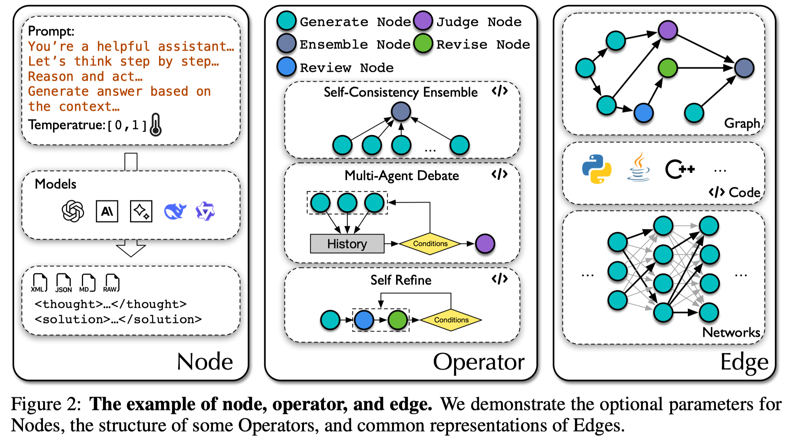

# 6.2 ICLR 2025 — AFlow 写作思路剖析

> **论文**：AFlow: Automating Agentic Workflow Generation
> **会议**：ICLR 2025
> **原文链接**：https://proceedings.iclr.cc/paper_files/paper/2025/file/5492ecbce4439401798dcd2c90be94cd-Paper-Conference.pdf

---

## 论文 Introduction 写作的思考模型（Introduction 是整个论文的精简版）

一般来说，Introduction 可以看作整篇论文的"压缩版"：用最少的篇幅把研究对象讲清楚，把问题为什么难讲透，再把我们的方法为什么必要讲明白。一个清晰的写作组织是：先用一个典型应用场景/运行例子引出研究背景与需求；随后对现有代表性工作进行归纳，提炼其在关键假设、数据特性、工作负载与系统约束下暴露的主要局限（通常不超过 3 点）；在此基础上进一步刻画该问题的本质属性与硬约束（例如规模、动态性、异构性、端到端开销、正确性/一致性要求等），从而自然导出本文要解决的研究目标或问题定义（Our Goal / Problem Formulation），或支撑方案设计的核心洞见（Key Idea）。接着，需要明确实现该目标所面临的关键挑战（通常不超过 3 点），解释为何直接套用或简单扩展已有方法难以奏效。最后给出与挑战一一对应的方法总览（整体框架与关键模块），并以贡献点收束：包括问题定义/设定（若有）、系统/框架设计、1–2 个关键技术点以及充分的实验评估与分析。

---

## Introduction 写作/构思的 Flowchart

Flowchart 的核心逻辑链：

> **研究背景** → **研究前沿（现有方法）** → **Limitations（不超过 3 点）** → **Key Idea / Our Goal** → **Challenges（不超过 3 点）** → **方法总览** → **贡献点**

---

## 基于 Flowchart，对原文 Introduction 的写法进行剖析

### 快速定位：这篇论文是什么类型？

**Technique paper（新方法解决既有问题）**
- 主轴：Key Idea / Mechanism
- Goal：一句话交代即可

AFlow 属于 Technique paper——对已有问题"Agentic Workflow 设计"提出新的自动化方法。

---

### 基于 Flowchart，我转成 Table，方便将原文思路映射到对应的逻辑阶段

> 请下载原文，对照着看。原文链接：https://proceedings.iclr.cc/paper_files/paper/2025/file/5492ecbce4439401798dcd2c90be94cd-Paper-Conference.pdf

| 逻辑阶段 | 原文内容与写作思路剖析 |
|---|---|
| **研究背景** | |
| 研究场景是什么？为什么重要？需要一个清晰的场景定义 + 研究动机 | "Large Language Models (LLMs) have emerged as powerful tools for solving complex tasks across various domains, including code generation, data analysis, decision-making, and question answering... However, the rapid advancement of LLMs heavily relies on manually designed agentic workflows – structured sequences of LLM invocations accompanied by detailed instructions. Designing and refining these workflows requires significant human effort, which limits the scalability and adaptability of LLMs to new, complex domains and hinders their ability to transfer skills across diverse tasks." **写作思路**：交代大的背景——LLMs 很牛，但 LLMs 的能力严重依赖于人工设计的 agentic workflows，这个人工设计过程费时费力，限制了可扩展性。 |
| **研究问题分析与属性解读** | |
| Limitation 1 | Recent efforts have focused on automating the discovery of effective agentic workflows to reduce the reliance on human intervention (Khattab et al., 2024; Yüksekg önül et al., 2024; Liu et al., 2023; Hu et al., 2024). Despite these advancements, full automation has not been achieved. For instance, Khattab et al. (2024) require manual workflow setup before automated prompt optimization. Similarly, methods proposed by Yüksekg önül et al. (2024) and Zhuge et al. (2024) fail to capture the full diversity of workflows necessary for a wide range of tasks (Yu et al., 2023; Yang et al., 2024b; Sun et al., 2023), as their optimization objectives struggle to represent the breadth of possible workflows. **写作思路**：虽然有工作开始探索自动化 workflow，但全自动化尚未实现，现有方法仍需大量人工介入，或无法覆盖足够多样的 workflow 结构。 |
| Limitation 2 | The inability to effectively model diverse workflow structures within these automated systems limits their utility and impact. ADAS (Hu et al., 2024) represents workflows using code, achieving a relatively complete representation. However, due to the efficiency limitations of its linear heuristic search algorithm, ADAS struggles to generate effective workflows within a limited number of iterations. **写作思路**：即便是代码化表示的方法（ADAS），搜索效率也受到线性启发式搜索的限制，无法在有限迭代内生成有效 workflow。 |
| Limitation 3 | 这篇论文没有讨论第三点局限。这篇论文主要针对"自动化编排工作流水平低"和"多样化工作流统一建模能力弱"两个局限，作为 AFlow 的方法动机。 |
| **论文的 Novelty 和创新思路讨论** | |
| Key Idea | AFlow 的核心洞见是将 agentic workflow 的设计问题转化为一个**代码级别的搜索优化问题**——通过 MCTS（蒙特卡洛树搜索）在代码空间中自动搜索最优的 workflow 结构，从而完全消除人工设计的需求。 |
| Challenges | 如何定义一个足够表达力的搜索空间（Search Space）来覆盖各种可能的 workflow 结构？如何在巨大的搜索空间中高效地找到最优解？ |
| 方法总览 | **To address these challenges**, we propose AFlow, a Monte Carlo Tree Search (MCTS)-based framework designed to systematically explore and discover optimal agentic workflows. **AFlow represents workflows as flexible nodes connected by code-based edges, which encapsulate possible relationships such as logical flows, conditions, and dependencies.** These edges allow the workflow to be modeled as a graph or network, offering a powerful structure for capturing complex interactions between LLM invocations. **To enhance the search process and improve efficiency, AFlow introduces a novel concept of operators — predefined, reusable combinations of nodes representing common agentic operations (e.g., Ensemble, Review & Revise).** These operators serve as foundational building blocks for constructing workflows and are integrated into the search space, ensuring that the exploration process leverages known patterns of effective agentic operations. **AFlow** employs the MCTS algorithm to navigate this infinite search space. The framework's workflow optimization process incorporates several key innovations: a soft mixed-probability selection mechanism for node exploration, LLM-driven node expansion to introduce new possibilities, execution evaluation to assess workflow performance, and backpropagation of experience to refine future search iterations. **写作思路**：第三个技术点（MCTS）一石二鸟地解决了"搜得慢"和"搜得不好"两个问题，是 AFlow 的核心创新。 |
| 贡献点 | **We make the following key contributions:** **(1) Problem Formulation:** We formalize the workflow optimization problem, generalizing prior approaches as specific cases. This provides a unified framework for future research at both the node and workflow optimization levels. **(2) AFLOW:** We introduce AFLOW, an MCTS-based method that automatically discovers effective workflows across multiple domains with minimal human intervention. **(3) Extensive Evaluation:** We evaluate AFLOW on six benchmark datasets: HumanEval, MBPP, MATH, GSM8K, HotPotQA, and DROP. AFLOW outperforms manually designed methods by 5.7% and surpasses existing automated approaches by 19.5%. Notably, workflows generated by AFlow enable smaller LLMs to outperform larger models, offering better cost-performance efficiency, with significant implications for real-world applications. |

---

## 关键插图

### Figure 2：Node / Operator / Edge 表示

这张图对应 AFlow 的核心表示设计，适合辅助解释"搜索空间如何被结构化表达"。

### Figure 3：Workflow Search Overview

这张图对应方法总览段落，完整展示 Search Space、MCTS 搜索过程与最终搜索结果三部分。

---

## 评论区批注（写作思路详细解读）

| 段落位置 | 批注内容 |
|---|---|
| 第 1 段（研究背景） | 交代大的背景，LLMs 很牛。 |
| 第 1 段后半（过渡） | 但 LLMs 的能力依赖于人工设计的 agentic workflows，引出核心矛盾。 |
| 后续段落 | 分析现有方法的局限性，然后自然过渡到 Key Idea 和方法总览。 |

---

## 其他资源

- AFlow 原文：https://proceedings.iclr.cc/paper_files/paper/2025/file/5492ecbce4439401798dcd2c90be94cd-Paper-Conference.pdf
- 建议配合 [3.2 Introduction 写作的思考模型](../03_Paper_Writing/3.2_Introduction写作的思考模型.md) 和 [3.3 技术类 Full Paper 思考模板](../03_Paper_Writing/3.3_技术类Full_Paper思考模板.md) 一起阅读
