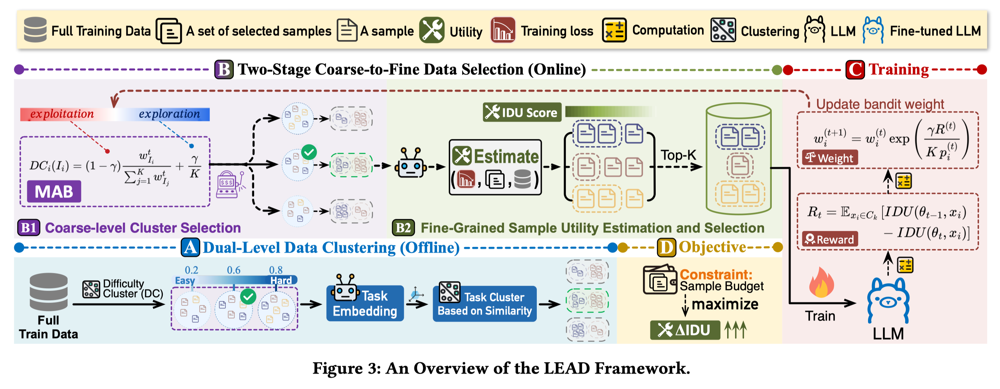

# 6.3 VLDB 2026 — LEAD 写作思路剖析

> **论文**：LEAD: Iterative Data Selection for Efficient LLM Instruction Tuning
> **会议**：VLDB 2026
> **原文链接**：https://arxiv.org/pdf/2505.07437

---

## 论文 Introduction 写作的思考模型（Introduction 是整个论文的精简版）

一般来说，Introduction 可以看作整篇论文的"压缩版"：用最少的篇幅把研究对象讲清楚，把问题为什么难讲透，再把我们的方法为什么必要讲明白。一个清晰的写作组织是：先用一个典型应用场景/运行例子引出研究背景与需求；随后对现有代表性工作进行归纳，提炼其在关键假设、数据特性、工作负载与系统约束下暴露的主要局限（通常不超过 3 点）；在此基础上进一步刻画该问题的本质属性与硬约束（例如规模、动态性、异构性、端到端开销、正确性/一致性要求等），从而自然导出本文要解决的研究目标或问题定义（Our Goal / Problem Formulation），或支撑方案设计的核心洞见（Key Idea）。接着，需要明确实现该目标所面临的关键挑战（通常不超过 3 点），解释为何直接套用或简单扩展已有方法难以奏效。最后给出与挑战一一对应的方法总览（整体框架与关键模块），并以贡献点收束：包括问题定义/设定（若有）、系统/框架设计、1–2 个关键技术点以及充分的实验评估与分析。

---

## Introduction 写作/构思的 Flowchart

Flowchart 的核心逻辑链：

> **研究背景** → **研究前沿（现有方法）** → **Limitations（不超过 3 点）** → **Our Goal / Key Idea** → **Challenges（不超过 3 点）** → **方法总览** → **贡献点**

---

## 基于 Flowchart，对原文 Introduction 的写法进行剖析

### 快速定位：这篇论文是什么类型？

**Propose a New Research Problem/Setting（新问题/新设定/新任务）**
- 主轴：Our Goal / Problem Formulation（问题定义本身是贡献）
- Key Idea：作为"为什么这样定义合理/可行"的支撑

> **批注**：该文属于这一类。对一个较大的研究问题（LLM 指令微调），提出了一个较为具体和实际的 Setting（无需额外推理开销实现高效地指令微调数据选择）。

---

### 基于 Flowchart，我转成 Table，方便将原文思路映射到对应的逻辑阶段

> 请下载原文，对照着看。原文链接：https://arxiv.org/pdf/2505.07437

| 逻辑阶段 | 原文内容与写作思路剖析 |
|---|---|
| **研究背景** | |
| 研究场景是什么？为什么重要？需要一个清晰的场景定义 + 研究动机 | "Instruction tuning has emerged as a powerful paradigm to improve the performance and alignment of large language models (LLMs) by fine-tuning them on instruction-response pairs. Recent studies indicate that data quality, rather than quantity alone, is crucial for substantial performance gains. Consequently, recent research has focused on automatically selecting informative subsets of training data, guided by selection metrics such as data diversity and data quality. In response, recent efforts have shifted toward model-aware data selection, which explicitly utilizes model-derived signals to dynamically identify informative training examples. These model-aware methods broadly fall into two categories: non-iterative and iterative." **写作思路**：常规引入大的问题背景——Instruction tuning 很重要，数据质量比数量更关键，引出 model-aware data selection 的两大类方法。 |
| **研究问题分析与属性解读** | |
| Limitation 1 | "Non-iterative methods select data once based on initial model predictions before iterative training. However, since they do not adapt to model evolution during training, their effectiveness is inherently limited." **写作思路**：A 类方法（Non-iterative）的不足——不能适应模型在训练过程中的演化，效果有限。 |
| Limitation 2 | "In contrast, iterative methods interleave model fine-tuning and data selection across multiple rounds, iteratively choosing new informative samples based on the model's latest feedback. As shown in Figure 1-Step 2-(b), most existing iterative model-aware methods typically rely on expensive full-dataset inference at each iteration to compute utility scores..." **写作思路**：B 类方法（Iterative）虽然更好，但每轮都需要对全量数据做推理来计算 utility scores，计算开销巨大。 |
| Limitation 3 | 这篇论文没有讨论第三类局限。因为这篇论文的思路是：解决这个问题有 A 方法和 B 方法，我们分别讨论 A 和 B 方法的不足，然后引出我们的 C 方法（即另辟蹊径，定义一个新的解决问题的 Setting）。 |
| **论文的 Novelty 和创新思路讨论** | |
| Our Goal — 这篇论文是提出新问题/新设定/新任务：主轴用 Our Goal/Problem Formulation（把问题定义成贡献之一），Key Idea 作为"为什么这样定义合理/可行"。 | "This predicament leads to a natural research question: **Can we retain the benefits of iterative model-aware data selection while eliminating the need for repeated full-dataset inference?**" **写作思路**：从 A 和 B 方法的不足中，自然引出一个新的研究问题——能否在保留迭代式数据选择优势的同时，消除每轮全量推理的开销？这个问题定义本身就是贡献。 |
| Key Idea | LEAD 的核心洞见是利用训练过程中模型自身产生的 loss 信号（training loss）作为数据选择的依据，而不需要额外的全量推理。这样就把"数据选择"和"模型训练"两个过程统一起来，实现了零额外推理开销的迭代式数据选择。 |
| Challenges | **Challenges.** Realizing this idea in practice is non-trivial. 如何从 training loss 中提取有效的数据选择信号？如何在不增加推理开销的前提下实现迭代式的数据质量评估？（注：Word 原稿中 Key Challenge 1 的详细内容为截图，无法还原；Challenge 2/3 在原稿中为空。） |
| 方法总览 | **Our Methodology: Iterative Data Selection with Inference-free Utility Estimation.** LEAD 框架在每轮训练中利用模型的 training loss 来动态评估数据的 utility，然后基于这些信号选择下一轮训练的数据子集，实现了高效的迭代式数据选择。（注：Word 原稿中方法论各技术点均以截图形式呈现，无法还原原文。） |
| 贡献点 | **(1) Problem Formulation**：提出无需额外推理开销的迭代式数据选择新 Setting。**(2) Instance-Level Dynamic Uncertainty (IDU)**：核心技术点。**(3) LEAD Framework**：完整框架设计。**(4) Theoretical Analysis**：理论分析。**(5) Extensive Experiments**：在多个 benchmark 上验证有效性和效率。（注：(1)(2)(4)(5) 的详细原文内容在 Word 原稿中为截图，无法还原。） |

---

## 关键插图

### Figure 3：LEAD Framework Overview

这张图最适合配合方法总览一起阅读，直观展示 Offline 聚类、Online 选择以及训练更新之间的关系。

---

## 评论区批注（写作思路详细解读）

| 段落位置 | 批注内容 |
|---|---|
| 论文类型定位 | 该文属于 "Propose a New Research Problem/Setting" 这一类。对一个较大的研究问题（LLM 指令微调），提出了一个较为具体和实际的 Setting（无需额外推理开销实现高效地指令微调数据选择）。 |
| 第 1 段（研究背景） | 常规引入大的问题背景。 |
| Limitation 分析 | 分别讨论 Non-iterative 和 Iterative 两类方法的不足，然后自然引出新的研究问题。 |
| Our Goal 引出 | 从两类方法的不足中，用一个自然的 research question 引出新的 Setting。 |

---

## 其他资源

- LEAD 原文：https://arxiv.org/pdf/2505.07437
- 建议配合 [3.2 Introduction 写作的思考模型](../03_Paper_Writing/3.2_Introduction写作的思考模型.md) 一起阅读
- 注意与 [6.1 Alpha-SQL](./6.1_ICML_2025_Alpha-SQL写作剖析.md)（Technique paper 类型）的对比：LEAD 是 "新问题/新设定" 类型，主轴是 Our Goal / Problem Formulation
